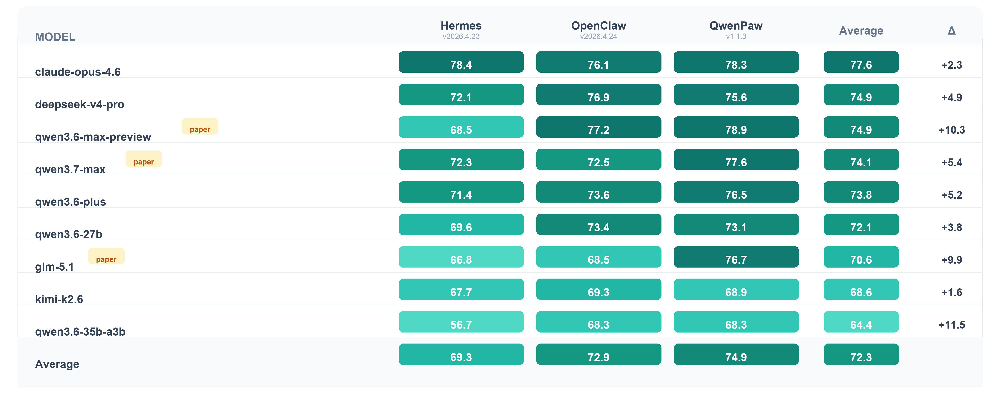

<h1 align="center">🐾 PawBench</h1>

<p align="center">
  <a href="README.md">English</a> ·
  <a href="README.zh-CN.md"><strong>简体中文</strong></a>
</p>

<p align="center">
  <a href="#任务构建">
    
  </a>
  <a href="https://agentscope-ai.github.io/PawBench/">
    
  </a>
  <a href="#harness">
    
  </a>
  <a href="https://agentscope-ai.github.io/PawBench/">
    
  </a>
  <a href="https://github.com/agentscope-ai/PawBench">
    
  </a>
</p>

<p align="center">
  <strong>面向通用智能体的评测基准，用来评估 LLM 和 Harness 的联合效果。</strong><br>
  150 道智能体任务 · 9 款模型 · 3 大 Harness · 深度诊断轨迹
</p>

---

同一个模型，放进不同的智能体运行框架里，表现可能会明显变化。一次任务失败，到底是模型没想明白，还是工具没给对、工作区没配置好、完成判定太宽松？只看最终成功率，很难回答这些问题。

PawBench 同时评估模型和承载模型运行的 Harness：

$$\text{Agent 表现} = f(\text{LLM}, \text{Harness})$$

v1.0 覆盖 **9 个模型 × 3 个 Harness × 150 道任务**。第一批结果显示，三家 Harness 的平均分最高和最低相差 **5.6 分**，已经接近一些模型版本升级带来的收益。以 `qwen3.6-35b-a3b` 为例，只切换 Harness，分数差距达到 **11.5 分**。

完整矩阵和切片分析见 [live leaderboard](https://agentscope-ai.github.io/PawBench/)。



通过 PawBench，你可以：

- **智能选型：** 为纯文本、多模态、Skill、Web 搜索等任务选择合适的模型 × Harness 组合。
- **瓶颈定位：** 把自己的 Harness 跑在同一组模型上，查看在哪些任务切片上落后。
- **闭环迭代：** 对照 trace 定位失败原因，并在修复后重新切片，验证目标分数是否真的提升。

## 快速开始

### 环境要求

需要 Python 3.11+ 和 Docker。Node.js 20+ 只在本地启动排行榜站点时需要。

安装依赖，并写入凭证。默认配置推荐使用 DashScope：

```bash
pip install -r requirements-dev.txt

cat > .env <<'EOF'
DASHSCOPE_API_KEY=...
JUDGE_API_KEY=...
JUDGE_BASE_URL=...
EOF
```

如果使用 OpenAI-compatible 或自定义 provider，再按需配置 `OPENAI_API_KEY` / `OPENAI_BASE_URL` 或 `CUSTOM_API_KEY` / `CUSTOM_BASE_URL`。

### 运行评测

```bash
# Smoke test：用默认 qwenpaw harness 跑一个 PawBench v1.0 任务
python run_bench.py \
  --benchmark-path . \
  --dataset pawbench-v1.0 \
  --tasks T001 \
  --model openai/gpt-4o

# 切换 Harness
python run_bench.py \
  --benchmark-path . \
  --dataset pawbench-v1.0 \
  --agents openclaw \
  --tasks T001 \
  --model dashscope/qwen3.6-plus

# 在指定任务集上横向对比多个 Harness
python run_bench.py \
  --benchmark-path . \
  --dataset pawbench-v1.0 \
  --agents qwenpaw openclaw hermes \
  --model dashscope/qwen3.6-plus \
  --tasks T002 T006

# 顺序评测多个模型
python run_bench.py \
  --benchmark-path . \
  --dataset pawbench-v1.0 \
  --model openai/gpt-4o \
  --model anthropic/claude-sonnet-4-6
```

评测结果默认写入 `./results/<年月日_时分秒>/pawbench/<model>/<agent>/`。其他参数（`--no-results-version-path`、`--save-workspace`、`--save-docker-image` 等）见 `python run_bench.py --help`。

### 查看排行榜

```bash
cd site
npm install
npm run build:data    # 汇总原始日志到 submissions/ 并生成前端 JSON
npm run dev           # http://localhost:4321/PawBench/
```

## PawBench Design

### 任务构建

PawBench 采用 **Reuse & Tag** 方法。它不是从零手写所有任务，而是从已有 Agent 评测集中抽取任务，统一成同一种格式，并按五个正交维度打标。

| 维度 | 字段 | 标签值 |
| :--- | :--- | :--- |
| 场景 | `scenario` | 13 个 L1 分类，例如 `Office_Productivity`、`Software_Engineering`、`Safety_Alignment` |
| 能力 | `capabilities` | `Logic_Reasoning`、`Math_Computation`、`Code_Manipulation`、`Tool_Use`、`Skill_Use`、`Planning`、`Self_Verification` |
| 复杂度 | `complexity` | `L1`（1-2 步）、`L2`（3-5 步）、`L3`（超过 5 步，含分支或回溯） |
| 模态 | `modality` | `text` 或 `multimodal`（`image`、`audio`、`video`） |
| 环境 | `environment` | `closed`（离线、可复现）或 `open`（需要联网或真实 SaaS API） |

v1.0 包含 **150 道任务**，来源包括 `claweval`、`qwenclawbench`、`pinchbench`、PawBench 自建任务、`skillsbench` 和 `wildclawbench`。

| 来源 | 数量 | 主要覆盖 |
| :--- | ---: | :--- |
| [`claweval`](https://github.com/claw-eval/claw-eval) | 52 | 办公协同、数据分析、内容创作 |
| [`qwenclawbench`](https://github.com/SKYLENAGE-AI/QwenClawBench) | 29 | 自动化、软件工程、安全对齐 |
| [`pinchbench`](https://github.com/pinchbench/skill) | 23 | 办公流程、软件工程、信息检索 |
| PawBench | 21 | 自建任务，覆盖自动化、信息检索、安全对齐 |
| [`skillsbench`](https://github.com/benchflow-ai/skillsbench) | 15 | 长程 Skill、领域自动化 |
| [`wildclawbench`](https://github.com/InternLM/WildClawBench) | 10 | 办公流程、安全对齐 |

### Harness

| Harness | 链接 |
| :--- | :--- |
| QwenPaw | [agentscope-ai/QwenPaw](https://github.com/agentscope-ai/QwenPaw) |
| OpenClaw | [openclaw/openclaw](https://github.com/openclaw/openclaw) |
| Hermes | [NousResearch/hermes-agent](https://github.com/NousResearch/hermes-agent) |

### 评测方案

每道任务会声明三种评分模式之一：

- `automated`：任务内置检查和断言。
- `llm_judge`：用 LLM-as-judge 评估偏语义的输出。
- `hybrid`：自动检查和 LLM 判断混合评分。

评测结果可以按 source、scenario、capability、complexity、modality、environment、grading type、model 和 harness 切片。PawBench 也会保存每道任务的 transcript 和 metrics。开启 `--save-workspace` 和 `--save-docker-image` 后，还可以保留 agent workspace 和最终 Docker 镜像，方便更深入地复盘。

## Roadmap

☐ 接入更多 Harness，包括 Claude Code、Cursor Agent、CoPaw，以及更多社区脚手架。

☐ 对 blog 中的发现做可控实验验证，尤其是工具数量、workspace 感知、Skill 发现、Web 工具和产物级完成校验。

☐ 引入更多任务类型，对 Harness 做更深入的压力测试，特别是 open-environment、multimodal、skill-heavy 和 long-horizon tasks。

☐ 改进 trace replay 和切片诊断能力，让 Harness 回归问题更容易定位。

## Contributing

欢迎社区贡献以下内容：

- 接入新的 Harness。
- 提交新的模型评测结果。
- 贡献任务，并按五维标签体系完成标注。
- 改进排行榜、切片分析或 trace 工具。

## 引用

如果你在研究或项目中使用到了 PawBench，请按照如下格式引用：

```bibtex
@misc{pawbench,
  title  = {PawBench: A benchmark for evaluating LLM × harness performance},
  author = {The OpenJudge Team},
  url    = {https://github.com/agentscope-ai/PawBench},
  month  = {06},
  year   = {2026}
}
```

## 致谢

PawBench 站在开源 Agent 评测社区的肩膀上，包括 [Claw-Eval](https://github.com/claw-eval/claw-eval)、[QwenClawBench](https://github.com/SKYLENAGE-AI/QwenClawBench)、[WildClawBench](https://github.com/InternLM/WildClawBench)、[PinchBench](https://github.com/pinchbench/skill)、[skillsbench](https://github.com/benchflow-ai/skillsbench) 等。
